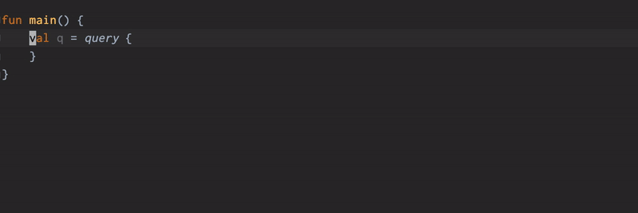

kraphql-github
====

[  ](https://bintray.com/lusingander/maven/kraphql-github/_latestVersion)

Kotlin DSL for [GitHub GraphQL API (GitHub API v4)](https://docs.github.com/en/free-pro-team@latest/graphql)

Current version: based on the [schema 2021-01-19](https://docs.github.com/en/free-pro-team@latest/graphql/overview/changelog#schema-changes-for-2021-01-19).

## About

With the power of Kotlin DSL, you can easily write type-safe queries for the GitHub GraphQL API.



## Installation

```groovy
repositories {
    jcenter()
}

dependencies {
    implementation 'com.github.lusingander:kraphql-github:0.0.6'
}
```

## Usage

```kotlin
fun main() {
    val q = query {
        search(query = "kotlin in:name sort:stars", first = 10, type = SearchType.REPOSITORY) {
            nodes {
                `on Repository` {
                    name
                    owner {
                        login
                    }
                    description
                    stargazerCount
                    pullRequests(first = 5, orderBy = IssueOrder(field = IssueOrderField.UPDATED_AT, direction = OrderDirection.DESC)) {
                        nodes {
                            number
                            title
                            updatedAt
                        }
                    }
                }
            }
            repositoryCount
        }
    }
    println(q.toString())
    // println(q.toEscapedString())

    // Output: (it doesn't actually include line breaks)
    //
    // query {
    //   search(first: 10, query: "kotlin in:name sort:stars", type: REPOSITORY) {
    //     nodes {
    //       ... on Repository {
    //         name
    //         owner {
    //           login
    //         }
    //         description
    //         stargazerCount
    //         pullRequests(first: 5, orderBy: {direction: DESC, field: UPDATED_AT}) {
    //           nodes {
    //             number
    //             title
    //             updatedAt
    //           }
    //         }
    //       }
    //     }
    //     repositoryCount
    //   }
    // }
}
```

For more details, see [examples.md](./examples.md).

## Related projects

Source codes are generated by [lusingander/kraphql](https://github.com/lusingander/kraphql).
